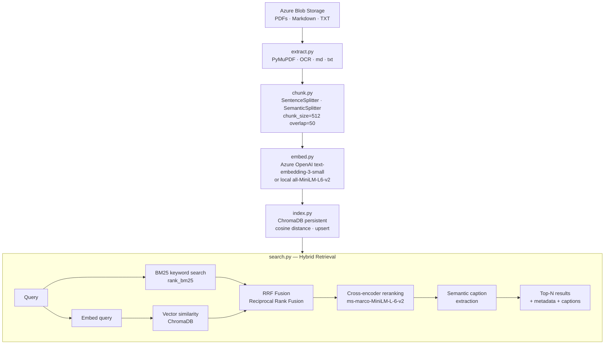

# BMO RAG Pipeline

A production-grade **Azure ETL & Retrieval-Augmented Search (RAG)** pipeline that extracts documents from Azure Blob Storage, chunks and embeds them, stores them in ChromaDB, and serves hybrid search (BM25 + vector + semantic reranking).

---

## Architecture



---

## Folder Structure

```
bmo_1st_project/
├── src/
│   ├── extract.py     # Azure Blob → DocumentRecord (PDF/MD/TXT)
│   ├── chunk.py       # DocumentRecord → ChunkRecord list
│   ├── embed.py       # ChunkRecord → EmbeddedChunk (with vectors)
│   ├── index.py       # EmbeddedChunk → ChromaDB
│   ├── ingest.py      # Orchestration: extract→chunk→embed→index
│   └── search.py      # Hybrid search: BM25+vector+rerank
├── notebooks/
│   └── demo.ipynb     # End-to-end walkthrough with visualisations
├── docs/
│   ├── README.md      # This file
│   └── architecture.md
├── .env.example       # Environment variable template
└── requirements.txt   # Pinned dependencies
```

---

## Setup

### 1. Clone and create a virtual environment

```bash
git clone <repo>
cd bmo_1st_project
python -m venv .venv
source .venv/bin/activate   # Windows: .venv\Scripts\activate
pip install -r requirements.txt
```

### 2. System dependencies (for OCR)

```bash
# macOS
brew install tesseract poppler

# Ubuntu / Debian
sudo apt-get install tesseract-ocr poppler-utils

# Windows
# Install Tesseract: https://github.com/UB-Mannheim/tesseract/wiki
# Install Poppler:  https://github.com/oschwartz10612/poppler-windows/releases
```

### 3. Configure environment variables

```bash
cp .env.example .env
# Edit .env and fill in your Azure credentials
```

Required variables:

| Variable | Description |
|---|---|
| `AZURE_STORAGE_CONNECTION_STRING` | Full Azure Storage connection string **or** use account name+key below |
| `AZURE_STORAGE_ACCOUNT_NAME` | Storage account name (if not using connection string) |
| `AZURE_STORAGE_ACCOUNT_KEY` | Storage account key (if not using connection string) |
| `AZURE_STORAGE_CONTAINER_NAME` | Blob container name (default: `documents`) |
| `AZURE_OPENAI_API_KEY` | Azure OpenAI API key (optional — falls back to local model) |
| `AZURE_OPENAI_ENDPOINT` | Azure OpenAI endpoint URL |
| `AZURE_OPENAI_DEPLOYMENT_NAME` | Embedding deployment name (default: `text-embedding-3-small`) |

Optional variables (have sensible defaults):

| Variable | Default | Description |
|---|---|---|
| `CHROMA_PERSIST_DIR` | `./chroma_db` | Path for ChromaDB storage |
| `CHUNK_SIZE` | `512` | Token chunk size |
| `CHUNK_OVERLAP` | `50` | Token overlap between chunks |
| `TOP_N_RESULTS` | `5` | Default search result count |
| `EMBEDDING_BATCH_SIZE` | `32` | Embedding API batch size |
| `LOG_LEVEL` | `INFO` | Python logging level |

---

## Running the Pipeline

### Full ingest (all documents)

```bash
python src/ingest.py
```

### Ingest specific blobs

```bash
python src/ingest.py --blobs manuals/deviceA.pdf troubleshooting/error101.md
```

### Reset collection and re-index

```bash
python src/ingest.py --reset
```

### Use semantic chunking (slower, higher quality)

```bash
python src/ingest.py --strategy semantic
```

### Search

```bash
python src/search.py "What causes error 101?"
python src/search.py "device configuration" --top-n 10 --source-type pdf_digital
python src/search.py "security policy" --full-text
```

### Run the notebook

```bash
jupyter notebook notebooks/demo.ipynb
```

---

## Module Quick Reference

### `extract.py`

```python
from extract import extract_all_documents, _build_container_client

container = _build_container_client()
docs = extract_all_documents(container)
# Returns List[DocumentRecord]
```

### `chunk.py`

```python
from chunk import chunk_documents

chunks = chunk_documents(docs, strategy='sentence')  # or 'semantic'
# Returns List[ChunkRecord]
```

### `embed.py`

```python
from embed import embed_chunks, get_query_embedding

embedded = embed_chunks(chunks)
query_vec = get_query_embedding("my search query")
```

### `index.py`

```python
from index import get_or_create_collection, index_chunks

collection = get_or_create_collection()
index_chunks(embedded, collection=collection)
```

### `search.py`

```python
from search import search

results = search("error 101 resolution", top_n=5)
for r in results:
    print(r.rank, r.blob_name, r.caption)
```

---

## Assumptions

1. **Container structure**: Documents are organised in subfolders (`manuals/`, `troubleshooting/`, `policies/`) but the pipeline processes all blobs regardless of folder.
2. **Language**: All documents are English (Tesseract OCR configured for `eng`).
3. **PDF scan detection**: A page with fewer than 50 characters (on average) is considered scanned. This threshold works well for technical documents but may need tuning for dense tables.
4. **Embedding dimensions**: Azure OpenAI `text-embedding-3-small` produces 1536-dim vectors; the local fallback produces 384-dim vectors. The two cannot be mixed in the same ChromaDB collection — if you switch embedding models, run `python src/ingest.py --reset`.
5. **BM25 index is in-memory**: The BM25 index is rebuilt from ChromaDB on each process start. For large collections (>100K chunks), this should be replaced with a dedicated search backend.

## Known Limitations

- **Scanned PDF quality**: OCR accuracy depends on scan quality and DPI. 300 DPI is the default; lower-quality scans may produce garbled text.
- **Table extraction**: PyMuPDF extracts table cells as plain text without structure. For table-heavy documents, consider Azure Document Intelligence.
- **Multilingual documents**: The pipeline is configured for English. Multi-language support requires setting `lang` in pytesseract and a multilingual embedding model.
- **BM25 + metadata filter mismatch**: BM25 searches the entire corpus; vector search respects the `filter_metadata` parameter. When a metadata filter is active, BM25 candidates from outside the filter may appear in RRF fusion. This is a known limitation — a production system would push BM25 inside the metadata-partitioned space.
- **Reranker latency**: The cross-encoder adds ~50–200ms per query depending on hardware. For latency-sensitive applications, use Cohere Rerank API instead.

---

## Development

### Run individual module smoke-tests

```bash
python src/extract.py   # requires Azure credentials
python src/chunk.py     # fully offline, uses synthetic data
python src/embed.py     # uses local model fallback if no Azure OpenAI key
python src/index.py     # uses temp ChromaDB dir
```
