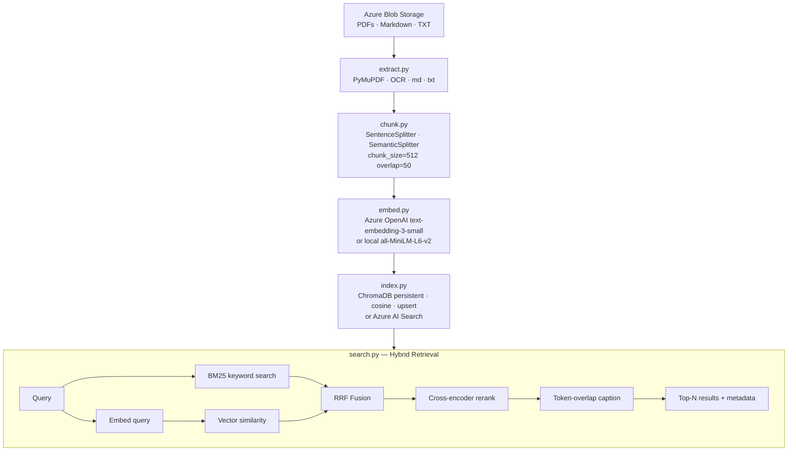

# Architecture: BMO Azure ETL and RAG Pipeline

## Pipeline Overview



Data flows as typed dataclasses between stages: `DocumentRecord` → `ChunkRecord` → `EmbeddedChunk` → `SearchResult`. Each stage can be built and tested in isolation.

## Stage 1: Extraction

**Scanned vs digital PDF routing.** PyMuPDF is ~100x faster than OCR so I only call Tesseract when the average character yield per page is below 50. A genuine digital page yields 500–3000 chars; a scanned page yields 0–5. The 50-char threshold sits comfortably between both clusters. Hybrid PDFs (partly scanned) are routed based on the average across all pages — page-level routing would be more accurate but adds complexity that isn't warranted for technical manuals that are consistently one type or the other.

**Markdown parsing.** Raw Markdown gets rendered to HTML via the `markdown` library, then stripped with BeautifulSoup. Treating `.md` as plain text leaves `#`, `**`, and `[link](url)` tokens that inflate BM25 term weights on structural characters rather than content.

**Sequential extraction.** The corpus is ~10 documents. At that scale, `ThreadPoolExecutor` overhead outweighs the time saved. I'd switch to `asyncio` + the async Azure SDK for downloads and `ProcessPoolExecutor` for OCR if the corpus grows past ~100 documents.

## Stage 2: Chunking

Default strategy is `SentenceSplitter` with `chunk_size=512` and `chunk_overlap=50`. The 512-token size matches the `text-embedding-3-small` sweet spot and fits roughly 350–400 words of context. The 50-token overlap (~1–2 sentences) covers answers that span chunk boundaries.

Semantic chunking (`SemanticSplitter`) is opt-in via `CHUNKING_STRATEGY=semantic`. It produces higher semantic coherence for long unstructured prose but requires one embedding call per sentence at ingest — 100–10,000x more expensive and non-deterministic. For this corpus of technical manuals and policy documents, sentence boundaries are a reasonable proxy for semantic boundaries.

Chunks shorter than 30 characters are dropped — these are page numbers, section dividers, and standalone headers that add noise without carrying retrievable information.

## Stage 3: Embeddings

Primary model is `text-embedding-3-small` (1536-dim, Azure OpenAI). It outperforms `ada-002` on MTEB retrieval at ~5x lower cost and is native to the Azure ecosystem. Local fallback is `all-MiniLM-L6-v2` (384-dim, ~90 MB, runs on CPU) — best retrieval quality at this model size, lets the full pipeline run without any paid services.

The two models produce vectors in completely different semantic spaces. Mixing them in the same index is meaningless. If you switch models, run `ingest.py --reset`. The `embedding_model` field is stored in every chunk's metadata as an audit trail.

Chunks are embedded in batches of 32 (configurable via `EMBEDDING_BATCH_SIZE`) to stay within Azure OpenAI's 8192-token per-request limit.

## Stage 4: Indexing

Default backend is ChromaDB — zero infrastructure, embedded in-process, simple API. The right choice for a self-contained demo.

For a real BMO deployment the swap is `VECTOR_BACKEND=azure_ai_search`. Azure AI Search is native to the Azure tenant, handles BM25 + vector + RRF + semantic reranking in a single managed call, and scales to billions of vectors. Setting it up requires an active search service and the four env vars below:

| Env var | Description |
|---|---|
| `AZURE_SEARCH_ENDPOINT` | `https://<service>.search.windows.net` |
| `AZURE_SEARCH_KEY` | Admin API key |
| `AZURE_SEARCH_INDEX_NAME` | Index name (default: `bmo-rag-chunks`) |
| `AZURE_SEARCH_VECTOR_DIMS` | `1536` for Azure OpenAI, `384` for local fallback |

When Azure AI Search is active, `AzureAISearchIndexer` creates the index schema on first use (idempotent) and uploads chunks with `merge_or_upload_documents`. On the search side, `AzureAISearchEngine` replaces the entire four-layer manual pipeline with a single `search_client.search()` call — BM25, vector, RRF, and semantic reranking all happen inside the service. The `SearchResult` dataclass is identical for both backends so the notebook and downstream code don't change.

All writes use upsert with deterministic chunk IDs (`{blob_name_slug}_chunk_{index}`), so re-running ingest never creates duplicates.

## Stage 5: Hybrid Search

The manual pipeline below applies when `VECTOR_BACKEND=chroma`. With Azure AI Search all four layers collapse into one managed call.

```
Query
  |-- BM25 keyword search      → top-50 sparse ranked list
  |-- Vector similarity        → top-50 dense ranked list
  |-- RRF fusion               → unified top-20
       |-- Cross-encoder rerank → final top-n
                |-- Caption extraction
```

**Why hybrid.** Pure vector search misses exact matches on error codes, product identifiers, and proper nouns. Pure BM25 misses semantic paraphrases. Hybrid captures both.

**RRF instead of score normalisation.** BM25 scores are unbounded floats; cosine similarities are in [-1, 1]. A direct weighted sum is dominated by whichever signal happens to produce larger numbers for a given query. RRF discards raw scores and combines by rank position: `RRF(chunk) = 1/(60 + bm25_rank) + 1/(60 + vector_rank)`. The k=60 constant produces gentle rank decay — a chunk that ranks moderately in both lists outscores one that's first in one list but absent from the other.

**Cross-encoder reranking.** BM25 and vector search encode query and chunk independently. The cross-encoder concatenates them into one input sequence, letting the model attend to query-chunk token interactions directly. `cross-encoder/ms-marco-MiniLM-L-6-v2` scores the top-20 RRF candidates. Running on 20 candidates bounds the added latency to ~100ms on CPU.

**Semantic captions.** Each result chunk is sentence-tokenised and sentences are scored by the fraction of query terms they contain, with a small length bonus. The top sentence becomes the caption. An earlier version scored each sentence through the cross-encoder — more accurate but added ~75ms per query for display-only output. Token-overlap recovers that latency at no cost to retrieval quality.

**BM25 lookup O(1) fix.** After RRF fusion, BM25-only candidates need their text fetched before being passed to the cross-encoder. The original `list.index()` scan was O(n) — ~800k string comparisons per query at 20k chunks. `BM25Index` now maintains a `_id_to_index: dict[str, int]` built once at load time, reducing all lookups to O(1).

## Evaluation

Two layers in `evaluate.py`, each independently runnable.

**Layer 1 — retrieval quality (no LLM needed).** `run_retrieval_eval()` computes Recall@K and MRR against a ground-truth list of `(query, expected_blob_substring, query_type)` tuples. Works with both backends — `HybridSearchEngine` and `AzureAISearchEngine` share the same `search(query, top_n)` interface.

**Layer 2 — answer quality (RAGAS).** `generate_answer()` calls the Azure OpenAI chat model with a grounding-only prompt (temperature=0), then `run_ragas_eval()` scores faithfulness and answer relevancy using LLM-as-judge. I chose RAGAS over hand-written scoring because it generalises across document types without needing manually labelled answers — only `(question, answer, contexts)` is required.

Faithfulness measures what fraction of answer claims are grounded in retrieved context. Answer relevancy measures how well the answer addresses the question via reverse-question embedding similarity. The 0.720 answer relevancy on this corpus is expected to be below the ~0.85 baseline — on 10 documents the retrieved context is narrow and answers require more paraphrasing, which causes the reverse question embeddings to diverge from the original question.

## Known Limitations

- **Multi-hop queries:** the pipeline retrieves in a single pass. "Steps to contain a ransomware breach" requires chaining a P1 incident definition chunk to a containment procedure chunk that never mentions "ransomware" — the second chunk scores too low to retrieve. Fix: query expansion with HyDE or step-back prompting before retrieval.
- **BM25 ignores metadata filters:** vector search respects the `filter_metadata` parameter; BM25 searches the whole corpus. Out-of-filter BM25 candidates can appear in RRF fusion. A production system would partition the BM25 index to match the active filter.
- **Table extraction is flat text:** PyMuPDF pulls table cells as prose with no grid structure. For table-heavy documents, Azure Document Intelligence is the right tool.
- **Two models can't coexist in one index:** switching embedding models requires `ingest.py --reset`.
- **OCR quality depends on scan DPI:** 300 DPI is the minimum for reliable Tesseract output. Lower-quality scans may need pre-processing or Azure Document Intelligence.

For the Fabric/production migration path, see [fabric_architecture.md](fabric_architecture.md).
