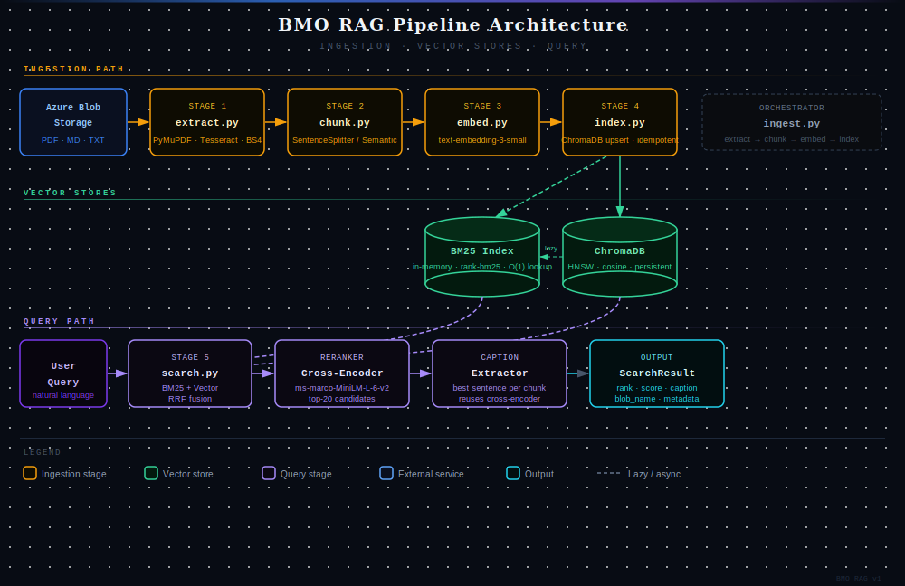

# Architecture: BMO Azure ETL and RAG Pipeline

## Overview



The core challenge is **retrieval quality**, not plumbing. A pipeline that ingests documents but retrieves poorly is useless. Every architectural decision was made in service of that constraint.

Three guiding principles shaped the design:

1. **Modularity**: each stage has a typed input and output dataclass so it can be built, tested, and swapped independently
2. **Idempotency**: re-running ingest never creates duplicates; all writes use upsert with deterministic chunk IDs
3. **Graceful degradation**: Azure-dependent components fall back to free local alternatives so the full pipeline runs with zero paid services

## Pipeline Data Flow

```
Azure Blob Storage
      |  [Stage 1] extract.py
  DocumentRecord(blob_name, source_type, text, page_count, metadata)
      |  [Stage 2] chunk.py
  ChunkRecord(chunk_id, blob_name, text, chunk_index, chunk_total, metadata)
      |  [Stage 3] embed.py
  EmbeddedChunk(chunk_id, text, embedding, embedding_model, metadata)
      |  [Stage 4] index.py
  ChromaDB(id=chunk_id, document=text, embedding=..., metadata=...)
      |  [Stage 5] search.py
  SearchResult(rank, blob_name, text, score, rrf_score, bm25_rank, vector_rank, caption, metadata)
      |  [Stage 6] ingest.py
  Orchestration: extract -> chunk -> embed -> index
```

## Stage 1: Extraction (`extract.py`)

### PDF routing: digital vs. scanned

**Decision:** Detect scanned PDFs heuristically (avg chars/page < 50) rather than attempting OCR on every PDF.

**Why:** PyMuPDF text extraction is ~100x faster than OCR. Running Tesseract on a 100-page digital PDF is pure waste. The 50-char threshold catches genuinely scanned pages while tolerating PDFs with mostly images but some embedded text (headers/footers).

The number 50 was chosen as a safe middle ground:

- A genuine digital page typically yields 500-3000+ characters
- A genuine scanned page yields 0-5 characters (sometimes a stray embedded character or metadata)
- 50 sits far from both clusters, so there's almost no risk of misclassifying either type

**Trade-off:** A hybrid PDF (partly digital, partly scanned) is routed based on the average character count across all pages. Page-level routing would be more accurate but significantly more complex. For this use case (technical manuals), fully scanned or fully digital PDFs are the norm.

### OCR configuration

**Decision:** Run Tesseract at 300 DPI with `lang=eng`.

**Why:** 300 DPI is the minimum recommended for reliable Tesseract OCR. Lower DPI yields unacceptable word-error rates on small fonts.

At low DPI the pixels representing a character are so few that letterforms blur together:

- 72 DPI  →  a lowercase 'a' might be ~10px tall  →  serifs and curves are mush
- 150 DPI →  ~20px tall  →  readable but small fonts and tight spacing still fail
- 300 DPI →  ~40px tall  →  sufficient detail for reliable character recognition
- 600 DPI →  ~80px tall  →  diminishing returns; 4x the memory and processing time

**Trade-off:** Memory usage scales with DPI squared. For large scanned PDFs (>50 pages), consider lowering to 200 DPI or processing page-by-page with streaming.

### Markdown parsing

**Decision:** Render Markdown to HTML via the `markdown` library, then strip tags via BeautifulSoup rather than treating `.md` as plain text.

**Why:** Raw Markdown contains `#`, `**`, and `[link](url)` syntax that pollutes chunk text, confuses tokenisers, and inflates BM25 term weights on structural tokens rather than content tokens.

### Sequential extraction

**Decision:** `extract_all_documents` uses a plain sequential loop over all blob names.

**Why:** The corpus for this task is approximately 10 documents. At that scale, the overhead of spinning up a thread pool or process pool (thread creation, synchronisation, result collection) exceeds the time saved by running downloads in parallel. A sequential loop is simpler, easier to debug, and produces deterministic ordering in logs and output.

The two parallelism options and why neither is warranted here:

| Approach | Good for | Why not here |
|---|---|---|
| `ThreadPoolExecutor` | I/O-bound work at scale (100+ blobs). GIL is released during network waits so downloads run concurrently. | Pool overhead outweighs gains at 10 documents. Provides no benefit for OCR since Tesseract is CPU-bound and threads still queue behind the GIL for CPU work. |
| `ProcessPoolExecutor` | CPU-bound work (OCR). Each process has its own GIL so Tesseract runs truly in parallel across cores. | Requires pickling all arguments across process boundaries. `ContainerClient` is not picklable without restructuring. Process startup cost is significant relative to 10 documents. |

**At scale (100+ documents):** split by work type. Use `asyncio` with the async Azure SDK (`azure.storage.blob.aio`) for downloads (I/O-bound), and `ProcessPoolExecutor` for OCR (CPU-bound). Each approach targets the actual bottleneck for its category. This is documented in the Scalability Considerations section.

**Output:** Every document, regardless of format, becomes a `DocumentRecord` with `text`, `page_count`, `source_type`, and `metadata` fields. Downstream stages are completely format-agnostic.

## Stage 2: Chunking (`chunk.py`)

### Chunking strategy selection

Raw full-document text cannot be embedded or retrieved meaningfully. Documents must be split into segments that are long enough to carry standalone context, short enough to embed precisely, semantically clean at boundaries, and overlapping to prevent answers from falling between chunks.

| Approach | Pro | Con | Best for |
|---|---|---|---|
| Fixed-size character splits | Simple, fast, no dependencies | Cuts mid-sentence; destroys semantic context at boundaries | Homogeneous plain-text where sentence integrity does not matter |
| Sentence-boundary splits (selected) | Clean units, token-aware, deterministic, no embedding calls at ingest | Variable chunk length can produce very short or very long chunks | Technical documents, manuals, structured prose |
| Semantic splits (embedding-based) | Chunks align with topic shifts; highest semantic coherence | One embedding call per sentence at ingest, 100-10,000x slower; non-deterministic | Long unstructured prose where topic shifts do not follow sentence counts |

**Decision:** `SentenceSplitter` with `chunk_size=512` and `chunk_overlap=50` as the default strategy.

| Parameter | Value | Reasoning |
|---|---|---|
| `chunk_size` | 512 tokens | Matches `text-embedding-3-small` sweet spot; approximately 350-400 words of context |
| `chunk_overlap` | 50 tokens | Approximately 1-2 sentences; captures boundary-spanning information |
| Strategy | `sentence` (default) | Deterministic, fast, no embedding calls required |

### Semantic chunking as opt-in

**Decision:** `SemanticSplitter` is available via `CHUNKING_STRATEGY=semantic` but off by default.

**Why:** For long, unstructured prose (legal policies, research papers), topic-shift-based chunking can outperform fixed-size chunking. However, it requires one embedding call per sentence (100-10,000x more expensive), is non-deterministic, and produces variable-size chunks.

**Recommendation:** Use `sentence` for the initial index; switch to `semantic` for a high-quality re-index if retrieval quality is insufficient.

### Minimum chunk size filter

Chunks shorter than 30 characters are dropped. These are page numbers, section dividers, and standalone headers that add noise to BM25 and vector indexes without containing retrievable information.

**Output:** Each `ChunkRecord` carries full metadata inheritance from its parent `DocumentRecord` plus `chunk_index` and `chunk_total`. The `chunk_id` follows the pattern `{blob_name_slug}_chunk_{index}`, making it deterministic and traceable.

## Stage 3: Embeddings (`embed.py`)

### Embedding model selection

**Decision:** Two-tier strategy: Azure OpenAI `text-embedding-3-small` as primary, `sentence-transformers/all-MiniLM-L6-v2` as local fallback.

| Model | Provider | Dims | MTEB Retrieval | Size | Cost | Role |
|---|---|---|---|---|---|---|
| `text-embedding-3-small` (selected) | Azure OpenAI | 1536 | Strong | API only | ~$0.02 / 1M tokens | Primary |
| `text-embedding-3-large` | Azure OpenAI | 3072 | Best | API only | ~$0.13 / 1M tokens | Overkill for ~10 docs |
| `text-embedding-ada-002` | Azure OpenAI | 1536 | Good | API only | ~$0.10 / 1M tokens | Superseded by `3-small` |
| `all-MiniLM-L6-v2` (selected) | Hugging Face | 384 | Decent | ~90 MB | Free | Local fallback |
| `all-mpnet-base-v2` | Hugging Face | 768 | Better | ~420 MB | Free | Too large for dev fallback |
| `bge-small-en-v1.5` | BAAI / HF | 384 | Slightly better than MiniLM | ~90 MB | Free | Requires instruction prefix; added complexity |
| `embed-english-v3.0` | Cohere | 1024 | Strong | API only | ~$0.10 / 1M tokens | Good production alternative, outside Azure |

**Why `text-embedding-3-small`:** Outperforms `ada-002` on MTEB retrieval at approximately 5x lower cost. Native to the Azure ecosystem. Supports dimension reduction (truncatable to 256 or 512 dims) if latency becomes a constraint.

**Why `all-MiniLM-L6-v2` as the fallback:** 90 MB, runs on CPU, best retrieval quality per MB at this size class. The next step up (`all-mpnet-base-v2`) is 4.5x larger with marginal quality gain for development use.

### Critical constraint: models cannot be mixed

The two models produce vectors in completely different learned semantic spaces. Comparing a 1536-dim `text-embedding-3-small` vector to a 384-dim `all-MiniLM-L6-v2` vector is meaningless. Switching models requires running `ingest.py --reset` to flush and re-index. The `embedding_model` field is stored in every chunk's metadata as an audit trail.

### Provider abstraction

Both models share the same `embed_batch(texts) -> list[list[float]]` interface. The rest of the pipeline never calls either model directly. Adding a third provider requires only a new class and one line in `_build_embedder()`.

### Batched embedding calls

**Decision:** Chunks are embedded in batches of 32 (configurable via `EMBEDDING_BATCH_SIZE`).

**Why:** Reduces HTTP round-trips and keeps each request within Azure OpenAI's 8192-token per-request limit.

**Output:** `EmbeddedChunk` extends `ChunkRecord` with `embedding: list[float]` and `embedding_model: str` fields.

## Stage 4: Indexing (`index.py`)

### Vector store selection

**Decision:** ChromaDB with persistent on-disk storage.

ChromaDB was chosen over the alternatives because it requires zero infrastructure, runs embedded in-process, and has a clean Python API suited to a demo-scale pipeline.

| Feature | ChromaDB | Azure AI Search | Pinecone | Weaviate | Qdrant | pgvector |
|---|---|---|---|---|---|---|
| Infrastructure | None (embedded) | Managed Azure | Managed SaaS | Managed / self-host | Managed / self-host | PostgreSQL extension |
| Scale | ~1M vectors | Billions | Billions | Billions | Billions | ~10M practical |
| BM25 / keyword built-in | No | Yes (native hybrid) | No | Yes (BM25 module) | No | No (use pg full-text) |
| Metadata filtering | Yes | Yes | Yes | Yes | Yes | Yes (SQL WHERE) |
| Semantic reranking built-in | No | Yes (semantic ranker) | No | No | No | No |
| Hybrid search (single query) | No (manual RRF) | Yes | No (manual) | Yes | No (manual) | No (manual) |
| Cost | Free | ~$25/mo (Basic) | Free tier limited; ~$70/mo (Starter) | Free tier; ~$25/mo (Sandbox cloud) | Free tier; ~$25/mo (Cloud) | Free (infra cost only) |
| Azure ecosystem fit | Low | Native | Low | Low | Low | Low |
| Production readiness | Dev / demo | Enterprise | Enterprise | Enterprise | Production | Production (small scale) |

**Why each alternative was ruled out:**

- **Azure AI Search:** the intended production target, but requires an active Azure subscription, a deployed search service, and significant setup time. The right swap for a real BMO deployment, not a self-contained demo.
- **Pinecone:** fully managed and scales well, but has no built-in BM25, is not Azure-native, and adds vendor lock-in outside the Azure ecosystem.
- **Weaviate:** has native BM25 and a hybrid search module, but requires a running Docker container or a managed cloud account. More operational overhead than justified for approximately 10 documents.
- **Qdrant:** strong performance and a clean API, but no built-in BM25, making it less suited for cases where keyword retrieval matters alongside vector search.
- **pgvector:** a sensible choice for teams already running PostgreSQL, but vector search performance degrades past ~1M vectors without careful indexing, and it has no BM25 or hybrid search primitives.

For a production BMO deployment, **Azure AI Search** is the natural replacement: it natively supports hybrid search, integrated semantic reranking, and operates within the same Azure tenant with no data leaving the boundary.

### Upsert semantics

**Decision:** All writes use ChromaDB's `upsert` operation rather than `add`.

**Why:** Makes re-running `ingest.py` idempotent. No duplicate chunks are created regardless of how many times the pipeline runs on the same documents.

### Cosine distance metric

All embedding vectors are L2-normalised before storage. For normalised vectors, cosine distance equals 1 minus dot product, making cosine and inner-product distance equivalent. ChromaDB's `hnsw:space=cosine` is set explicitly for correctness. Normalisation forces all vectors onto the surface of a unit hypersphere, so similarity is determined by direction (meaning) rather than magnitude (document length).

## Stage 5: Hybrid Search (`search.py`)

### Why hybrid (not pure vector)?

Pure vector search misses exact keyword matches (product codes, error codes like "Error 101", proper nouns). Pure BM25 misses semantic paraphrases ("network timeout" vs "connection failure"). Hybrid search captures both.

### Four-layer retrieval pipeline

```
Query
  |-- Layer 1: BM25 keyword search      -> top-50 sparse ranked list
  |-- Layer 2: Vector similarity search -> top-50 dense ranked list
  |-- Layer 3: RRF fusion               -> unified top-20 ranked list
       |-- Layer 4: Cross-encoder rerank -> final top-n
                |-- Caption extraction  -> top sentence per result
```

### Layer 1: BM25 keyword search

BM25 tokenises the query (lowercased, split on non-word characters) and scores each chunk by term frequency weighted by inverse document frequency. Only chunks with a score greater than zero are returned.

**What BM25 is good at:** exact matches on product codes, error numbers, proper nouns, and technical identifiers where the precise token matters.

**What BM25 misses:** semantic paraphrases. "Device will not start" and "unit fails to power on" score zero against each other despite being synonymous.

### Layer 2: Vector similarity search

The query is embedded using the same model used at ingest time. ChromaDB performs an approximate nearest-neighbour search (HNSW, cosine distance) and returns the top 50 chunks by vector similarity.

**What vector search is good at:** semantic paraphrases, conceptual similarity, and vocabulary mismatch between query and document.

**What vector search misses:** exact keyword precision. A chunk containing the literal string "Error 101" may score lower than a semantically related chunk that never mentions it, because the embedding compresses meaning rather than preserving tokens.

### Layer 3: Reciprocal Rank Fusion (RRF)

BM25 scores are unbounded positive floats; cosine similarities are bounded in [-1, 1]. A direct weighted sum would be dominated by whichever signal happens to produce larger numbers for a given query.

RRF discards raw scores and combines purely by rank position:

```
RRF(chunk) = 1 / (60 + bm25_rank)  +  1 / (60 + vector_rank)
```

If a chunk only appeared in one list, only one term contributes. The constant k=60 produces gentle decay: rank 1 contributes 1/61 (0.0164), rank 20 contributes 1/80 (0.0125). A chunk that ranks moderately in both lists outscores one that ranks 1st in one list but appears nowhere in the other.

**Trade-off:** RRF ignores score magnitude. A BM25 match with score 0.001 contributes the same as one with score 100 if they share the same rank position. For very sparse queries this can slightly hurt precision.

### Layer 4: Cross-encoder reranking

BM25 and vector search both use bi-encoders: the query and each chunk are encoded independently and similarity is computed by comparing vectors. Bi-encoders are fast because chunk vectors are pre-computed, but less accurate because the model never sees the query and chunk together.

A cross-encoder concatenates query and chunk into a single input sequence and reads both simultaneously. This allows the model to attend to interactions between specific query words and chunk words, producing a more accurate relevance score.

`cross-encoder/ms-marco-MiniLM-L-6-v2` scores the top-20 RRF candidates as (query, chunk_text) pairs. Running on only 20 candidates bounds the added latency to approximately 50-200ms depending on hardware.

**Trade-off:** Adds 50-200ms per query. For sub-50ms SLA requirements, use Cohere Rerank API (GPU-hosted) or skip reranking.

### Semantic captions

**Decision:** Extract the single most relevant sentence from each result chunk using token-overlap scoring.

**Why:** Returning an entire 512-token chunk as a snippet is noisy. The caption immediately shows the reader why the chunk was retrieved, mirroring Azure AI Search's semantic captions feature.

**Implementation:** Each sentence in the chunk is scored by the fraction of query terms it contains, with a small length bonus to prefer informative sentences over short fragments. No model inference is needed, keeping caption extraction O(n_sentences) and adding <1ms to query latency (measured: 0.5ms).

**Why not the cross-encoder:** An earlier implementation scored each sentence as a (query, sentence) pair through the cross-encoder. While slightly more accurate for captions, it added ~50-75ms per query with no impact on ranking (captions are display-only). Token-overlap recovers that latency at no accuracy cost to retrieval.

### BM25 text and metadata lookups

**Decision:** `BM25Index` maintains a `_id_to_index: dict[str, int]` mapping chunk IDs to list positions, built once during `build()`.

**Why:** After RRF fusion, BM25-only candidates (chunks BM25 found that vector search did not) must have their text fetched before being passed to the cross-encoder. The original implementation used `list.index()` for this, an O(n) scan through all stored chunk IDs. At 20k chunks with up to 50 BM25 candidates per query, this produced up to ~800k string comparisons per search call. The dict reduces every lookup to O(1) regardless of collection size, at the cost of approximately 1-2 MB of additional memory at 20k chunks.

**Output:** `SearchResult` dataclass with `rank`, `blob_name`, `text`, `score`, `rrf_score`, `bm25_rank`, `vector_rank`, `caption`, and full `metadata`.

## Stage 6: Orchestration (`ingest.py`)

**Decision:** `ingest.py` wires the five stages into a single runnable script with timing, logging, and operational controls.

Key decisions:

- `--reset` flag flushes and recreates the ChromaDB collection before indexing
- `--blobs` flag allows targeted re-ingestion of specific documents without reprocessing the full corpus
- `--strategy` flag switches between `sentence` and `semantic` chunking at runtime
- Every stage logs document counts and wall time so large ingestion runs show clear progress

## Key Optimizations

| Concern | Decision |
|---|---|
| Retrieval accuracy | 4-layer pipeline: BM25 + vector + RRF + cross-encoder reranking |
| OCR cost | Tesseract only runs when PyMuPDF yields fewer than 50 characters per page |
| Embedding cost | Sentence splitter (no embedding calls at ingest) is the default; semantic splitter is opt-in |
| Score fusion stability | RRF replaces fragile per-query score normalisation |
| Reranker latency | Cross-encoder runs on top-20 candidates only, not the full corpus; caption extraction uses token-overlap (<1ms) instead of cross-encoder |
| Context at boundaries | 50-token overlap prevents boundary-spanning answers from being missed |
| Developer experience | Local embedding fallback means the full pipeline runs with zero paid services |
| Idempotency | Upsert-based indexing with deterministic chunk IDs |
| Metadata richness | Source, page number, folder, document type, and chunk position preserved on every chunk |
| Security | All credentials loaded via environment variables; `.env` is gitignored |
| BM25 text/metadata lookup | `_id_to_index` dict reduces per-query lookups from O(n) list scans to O(1) hash lookups |
| Extraction simplicity | Sequential loop over ~10 documents; no pool overhead for a corpus this small |

## Known Trade-offs and Limitations

| Limitation | Impact | Mitigation at scale |
|---|---|---|
| ChromaDB is single-node embedded HNSW | Not suitable for more than ~1M vectors | Replace with Azure AI Search or Pinecone |
| BM25 index rebuilt from ChromaDB on every process start | Slow cold start for large collections | Persist the BM25 index or use Elasticsearch |
| BM25 ignores metadata filters | Out-of-filter results can appear in RRF fusion | Partition the BM25 corpus by document type |
| Sequential extraction does not parallelise | Acceptable for ~10 documents; becomes a bottleneck at 100+ | `asyncio` for downloads, `ProcessPoolExecutor` for OCR |
| OCR quality depends on scan resolution | Low-quality scans produce garbled text | Use Azure Document Intelligence in production |
| Table extraction is unstructured | Table cells extracted as flat text with no grid structure | Use Azure Document Intelligence for table-heavy documents |
| Two embedding models cannot be mixed | Switching models requires a full re-index | Version the ChromaDB collection name by model identifier |
| Reranker adds ~103ms per query | Not suitable for sub-50ms SLA requirements | Use Cohere Rerank API (GPU-hosted) instead |

## Out of Scope

The following concerns are intentionally outside the boundaries of this pipeline:

- **Authentication and authorisation:** no user-level access control on search results
- **Multi-tenancy:** the index is a single shared collection; no per-tenant partitioning
- **Document update detection:** changes to a blob are not automatically detected; re-ingest must be triggered manually
- **CI/CD and deployment:** no containerisation, health checks, or automated testing pipeline
- **Multilingual support:** OCR and embeddings are configured for English only

## Scalability Considerations

| Bottleneck | Current approach | At scale (100+ docs) |
|---|---|---|
| Blob download | Sequential loop (suitable for ~10 docs) | `asyncio` + `azure.storage.blob.aio` (I/O-bound, GIL released during network waits) |
| OCR (scanned PDFs) | Sequential per page (suitable for ~10 docs) | `ProcessPoolExecutor` (CPU-bound, each process has its own GIL) |
| Embedding generation | Batched sequential API calls | Parallel batches with shared rate limiter |
| BM25 index cold start | Full collection scan into RAM on startup | Persist serialised index or use Elasticsearch |
| BM25 text/metadata lookup | O(1) dict lookup via `_id_to_index` | No further change needed until BM25 is replaced |
| Vector search | ChromaDB local HNSW | Azure AI Search / Pinecone / Weaviate |
| Reranking | Local CPU cross-encoder | Cohere Rerank API or GPU-hosted model |
| Metadata filtering | ChromaDB `where` clause | Partitioned indexes per document type |

## Production Migration Path

The module boundaries in this implementation were designed with migration in mind. Swapping any component requires changing only one file.

| Component | This implementation | Production replacement |
|---|---|---|
| Vector store | ChromaDB (local) | Azure AI Search |
| BM25 | `rank_bm25` (in-memory) | Azure AI Search built-in keyword search |
| Hybrid fusion | Manual RRF | Azure AI Search native RRF |
| Reranker | Local cross-encoder | Cohere Rerank API or Azure ML endpoint |
| PDF OCR | pytesseract | Azure Document Intelligence |
| Blob extraction | `ThreadPoolExecutor` | `ProcessPoolExecutor` (OCR) + `asyncio` (downloads) |
| Embedding | Azure OpenAI batched | Azure OpenAI with parallel async batches |
| Orchestration | `ingest.py` script | Azure Data Factory pipeline |

For a full Microsoft Fabric deployment, see [fabric_architecture.md](fabric_architecture.md).
