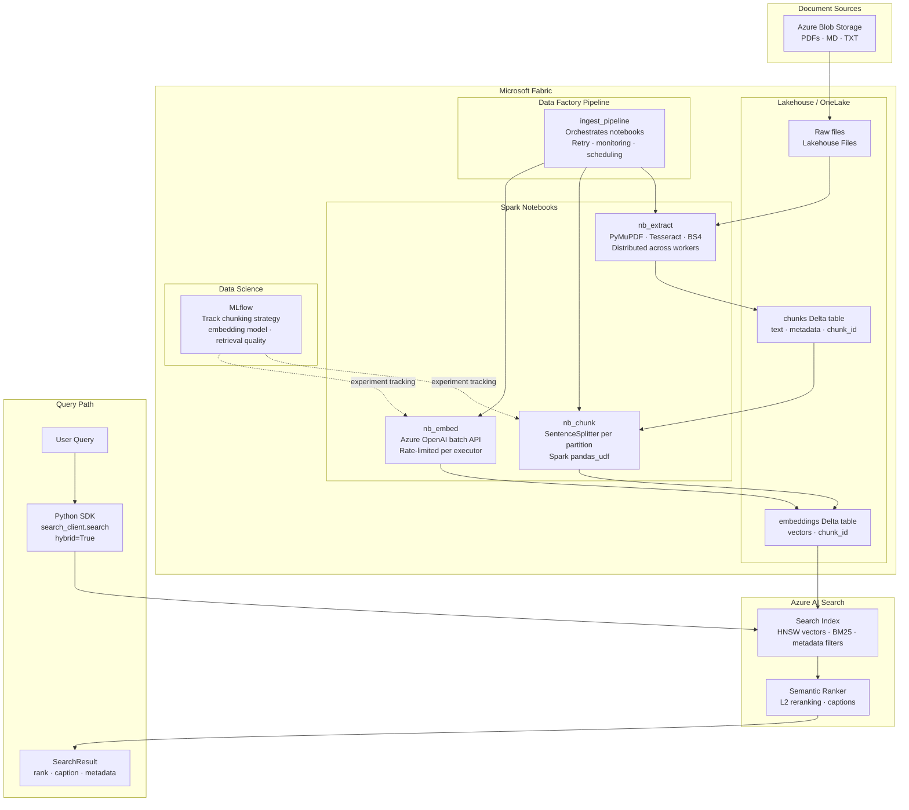

# Microsoft Fabric: Production Migration Notes

This doc sketches how I'd move the pipeline to Fabric for a real BMO deployment. The current setup (ChromaDB + in-memory BM25 + local cross-encoder) works fine for a demo but hits obvious limits at scale: single-machine OCR, BM25 rebuilt from scratch on every restart, no retry/monitoring on ingest.



## Stage changes

**Extraction:** `extract.py` runs inside a Spark notebook (`nb_extract`) on a Fabric cluster. Documents are copied from Blob Storage into OneLake first via a Data Factory Copy activity — this avoids crossing a network boundary on every read. OCR parallelises naturally across executors since Tesseract subprocesses bypass Python's GIL. Output goes to a `raw_documents` Delta table.

**Chunking:** `SentenceSplitter` is stateless so it wraps cleanly into a `pandas_udf`. The `SemanticSplitter` doesn't fit here — it needs embedding calls per sentence which makes rate-limit coordination across executors painful. I'd keep semantic chunking as an offline/manual option.

**Embeddings:** `mapInPandas` replaces the sequential batch loop. The main thing to get right is a shared rate limiter across executors — without it, 8 executors all hammering the OpenAI endpoint will hit TPM limits fast. A Fabric shared notebook variable or a Redis counter both work. Vectors write to a Delta table so the pipeline can resume from this stage without re-chunking.

**Indexing + Search:** This is where the biggest simplification happens. Azure AI Search natively handles BM25, HNSW vector search, RRF fusion, semantic reranking, and caption extraction in a single managed call. The ~250 lines in `search.py` collapse to roughly this:

```python
results = search_client.search(
    search_text=query,
    vector_queries=[VectorizableTextQuery(text=query, fields="embedding")],
    query_type="semantic",
    semantic_configuration_name="bmo-semantic-config",
    top=top_n,
    select=["blob_name", "text", "source_type", "chunk_index"],
)
```

**Orchestration:** Data Factory pipeline replaces `ingest.py`. Supports scheduling, event triggers (new blob uploaded → immediate ingest), retry, and email alerts. MLflow (built into Fabric Data Science) tracks chunking strategy, chunk counts, and retrieval quality per run.

## Component mapping

| Current | Fabric replacement | What goes away |
|---|---|---|
| `extract.py` sequential loop | Spark notebook on Fabric cluster | Single-machine throughput ceiling |
| `chunk.py` sequential loop | Spark `pandas_udf` | Same |
| `embed.py` sequential batches | `mapInPandas` + rate limiter | Sequential API calls, RAM accumulation |
| ChromaDB local HNSW | Azure AI Search vector index | Manual persistence, single-node limit |
| `rank_bm25` in-memory | Azure AI Search BM25 | Cold-start rebuild, memory footprint |
| Manual RRF + cross-encoder | AI Search RRF + semantic ranker | ~60 lines of fusion code, local model |
| `ingest.py` script | Data Factory pipeline | Manual execution, no monitoring |

## Rough cost

Azure AI Search S1 (~$250/month) is the dominant line item — it covers BM25, HNSW, RRF, and the semantic ranker, so it replaces several free-but-operational-burden components. Fabric Spark compute is billed per CU-hour (F4 ~$0.36/CU-hour) and only runs during ingest, so cost scales with ingest frequency rather than being a fixed monthly charge. Embeddings cost doesn't change.

For a corpus under ~500 documents updated infrequently, the current single-machine pipeline is cheaper and simpler. Fabric makes sense once OCR throughput or search query volume becomes the bottleneck.
