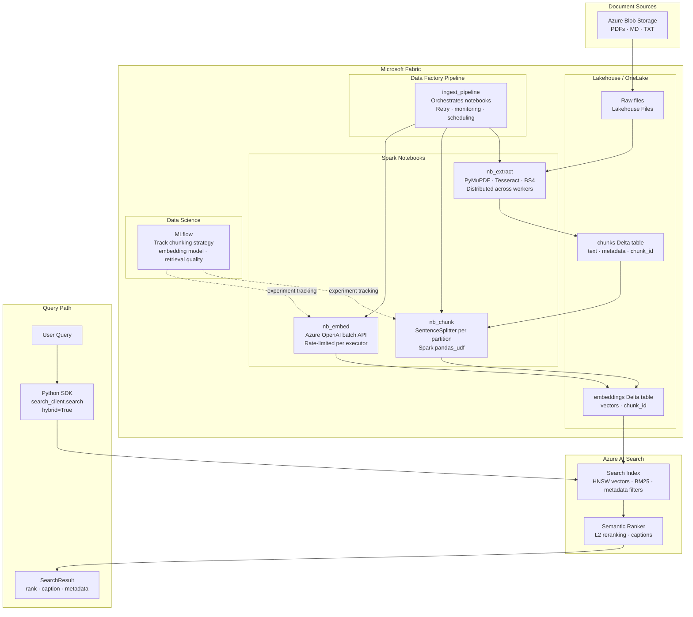

# Microsoft Fabric: RAG Pipeline Architecture

## Overview

This document describes how the BMO RAG pipeline would be redesigned on Microsoft Fabric for a production deployment. The current implementation (ChromaDB + in-memory BM25 + local cross-encoder) is purpose-built for a self-contained demo. A real BMO deployment needs distributed ingestion at scale, enterprise search quality, and operational observability. Fabric addresses all three.

The core RAG concepts remain unchanged. What changes is where each stage runs and which managed service handles it.



## How Each Stage Maps to Fabric

### Stage 1: Extraction

**Current:** `extract.py` runs on one machine, `ThreadPoolExecutor` with 8 workers, sequential OCR.

**Fabric:** A Spark notebook (`nb_extract`) runs on a Fabric Spark cluster. Documents are read from the Lakehouse Files section of OneLake using `mssparkutils.fs`. Each Spark executor processes a partition of documents in parallel. OCR (Tesseract) runs inside each executor, bypassing Python's GIL limitation because Spark workers are separate JVM processes with Python subprocesses.

Key decision: documents are copied from Azure Blob Storage into OneLake first (via a Data Factory Copy activity), making all downstream Spark access local to the Fabric tenant rather than crossing a network boundary on every read.

Output: a Delta table (`raw_documents`) with columns `blob_name`, `source_type`, `text`, `page_count`, `size_bytes`.

**Scanned PDF handling at scale:** With 1000 scanned PDFs, Tesseract OCR is distributed across all executors. A Spark cluster with 8 nodes at 4 cores each runs 32 OCR jobs concurrently instead of 8. Wall time drops from hours to minutes.

### Stage 2: Chunking

**Current:** `chunk.py` loops sequentially over all documents on one machine.

**Fabric:** A Spark notebook (`nb_chunk`) reads the `raw_documents` Delta table, applies `SentenceSplitter` inside a `pandas_udf` so chunking runs per partition in parallel, and writes results to a `chunks` Delta table.

Key decision: `SentenceSplitter` is stateless and deterministic, making it safe to run inside a `pandas_udf` without coordination between executors. The `SemanticSplitter` (which requires embedding calls per sentence) is unsuitable for a Spark `pandas_udf` without careful rate-limit management and is kept as an offline option.

Output: a Delta table (`chunks`) with columns `chunk_id`, `blob_name`, `text`, `chunk_index`, `chunk_total`, `source_type`, `char_start`.

### Stage 3: Embeddings

**Current:** `embed.py` calls Azure OpenAI in sequential batches of 32, no rate limiting, all results held in RAM.

**Fabric:** A Spark notebook (`nb_embed`) reads the `chunks` table and calls Azure OpenAI using `mapInPandas`. Each executor submits batches of 32 chunks concurrently. A shared rate-limiter (implemented via a Fabric Notebook shared variable or a Redis counter) prevents TPM exhaustion across executors.

Key decision: embedding vectors are written directly to a Delta table (`embeddings`) as arrays of floats rather than held in memory. This means the pipeline can be resumed from the embed stage without re-extracting or re-chunking.

Output: a Delta table (`embeddings`) with columns `chunk_id`, `embedding` (array of float), `embedding_model`.

### Stage 4: Indexing

**Current:** `index.py` upserts into a local ChromaDB instance.

**Fabric:** A Data Factory activity pushes the `embeddings` Delta table to an Azure AI Search index using the Search SDK or the built-in Azure AI Search connector. The index is configured with:

- HNSW vector field on the embedding column (replaces ChromaDB HNSW)
- Full-text BM25 field on the chunk text (replaces `rank_bm25` in-memory index)
- Metadata fields (`source_type`, `blob_name`, `chunk_index`) as filterable facets

Key decision: Azure AI Search natively supports hybrid search (vector + BM25 in a single query), Reciprocal Rank Fusion (built-in, no manual implementation needed), and a semantic ranker that replaces the local `cross-encoder/ms-marco-MiniLM-L-6-v2`. This eliminates three separate components from the current `search.py`.

### Stage 5: Search

**Current:** `search.py` manually orchestrates BM25 query, vector query, RRF fusion, cross-encoder reranking, and token-overlap caption extraction in ~250 lines of code.

**Fabric / Azure AI Search:** A single `search_client.search()` call with `query_type="semantic"` and `vector_queries=[...]` replaces the entire manual pipeline. The Search SDK handles RRF fusion internally. The semantic ranker handles reranking and caption extraction.

```python
from azure.search.documents import SearchClient
from azure.search.documents.models import VectorizableTextQuery

results = search_client.search(
    search_text=query,
    vector_queries=[VectorizableTextQuery(text=query, fields="embedding")],
    query_type="semantic",
    semantic_configuration_name="bmo-semantic-config",
    top=top_n,
    select=["blob_name", "text", "source_type", "chunk_index"],
)
```

The `search.py` module is reduced to a thin wrapper around this call.

### Orchestration

**Current:** `ingest.py` is a Python script run manually or via cron.

**Fabric:** A Data Factory pipeline (`ingest_pipeline`) chains the three Spark notebook activities with dependencies, retry policies, and email alerts on failure. The pipeline can be triggered:

- On a schedule (nightly re-index)
- On a OneLake file event (new document uploaded triggers immediate ingest)
- Manually from the Fabric portal or REST API

MLflow experiments (built into Fabric Data Science) track each pipeline run: chunking strategy used, number of chunks produced, embedding model, index size, and a sample of retrieval quality metrics.

## Component Mapping

| Current component | Fabric replacement | What is eliminated |
|---|---|---|
| `extract.py` sequential loop | Spark notebook + Fabric Spark cluster | Single-machine throughput ceiling |
| `chunk.py` sequential loop | Spark `pandas_udf` per partition | Single-machine throughput ceiling |
| `embed.py` sequential batches | Spark `mapInPandas` + shared rate limiter | Sequential API calls, RAM accumulation |
| ChromaDB local HNSW | Azure AI Search vector index | Single-node limit, manual persistence |
| `rank_bm25` in-memory | Azure AI Search BM25 | Cold-start rebuild, memory footprint, O(n) lookup |
| Manual RRF fusion | Azure AI Search built-in RRF | ~60 lines of custom fusion code |
| `cross-encoder/ms-marco-MiniLM-L-6-v2` local | Azure AI Search semantic ranker | Local model download, CPU inference latency |
| `ingest.py` script | Data Factory pipeline | Manual execution, no retry, no monitoring |
| Python logging | Fabric Monitoring Hub + MLflow | No cross-run visibility |

## What Stays the Same

The following are unchanged regardless of platform:

- **Extraction logic:** PyMuPDF for digital PDFs, Tesseract for scanned PDFs, BeautifulSoup for Markdown. These run inside Spark executors exactly as they do locally.
- **Chunking parameters:** `chunk_size=512`, `chunk_overlap=50`, minimum chunk filter of 30 characters.
- **Embedding model:** `text-embedding-3-small` produces the same 1536-dim vectors.
- **Hybrid retrieval concept:** BM25 + vector + reranking + captions. The logic is identical; the execution moves into managed services.
- **Metadata schema:** `source_type`, `blob_name`, `chunk_index`, `chunk_total` are preserved on every chunk and remain filterable.

## Cost Comparison

| Component | Current (demo) | Fabric production | Notes |
|---|---|---|---|
| Compute (ETL) | Free (local CPU) | Fabric Spark capacity units | Billed per CU-hour; F4 SKU ~$0.36/CU-hour |
| Vector store | Free (ChromaDB) | Azure AI Search S1 ~$250/month | Includes BM25, RRF, semantic ranker |
| Embeddings | Azure OpenAI pay-per-token | Same | No change |
| Reranking | Free (local model) | Included in AI Search semantic ranker | Eliminates Cohere Rerank cost |
| Storage | Azure Blob (existing) | OneLake (included with Fabric) | Delta tables at Blob Storage pricing |
| Orchestration | Free (manual script) | Data Factory activities ~$1/1000 runs | Negligible at ingest frequency |

The Azure AI Search S1 tier (~$250/month) is the dominant cost. At enterprise scale (5000+ documents, 100k+ queries/month), this is justified by eliminating the operational burden of managing ChromaDB, the BM25 index, the cross-encoder, and manual RRF.

## Migration Path from Current Implementation

The current module boundaries were designed with this migration in mind. Each swap touches one file.

| Step | Action | Files changed |
|---|---|---|
| 1 | Copy documents from Azure Blob into OneLake Lakehouse | Config only |
| 2 | Wrap `extract_document` logic inside a Spark `pandas_udf` | `extract.py` |
| 3 | Wrap `chunk_document` logic inside a Spark `pandas_udf` | `chunk.py` |
| 4 | Replace `embed_chunks` loop with `mapInPandas` | `embed.py` |
| 5 | Replace `index_chunks` (ChromaDB) with Azure AI Search push indexer | `index.py` |
| 6 | Replace `HybridSearchEngine` with `SearchClient.search()` wrapper | `search.py` |
| 7 | Replace `run_pipeline` with Data Factory pipeline definition | `ingest.py` removed |

Steps 2 through 4 can be done incrementally. The Delta tables act as checkpoints between stages, so each stage can be developed and tested independently before the next is migrated.

## When Fabric is Not the Right Choice

Fabric adds cost and operational complexity that is not justified in all cases:

- For a corpus under ~500 documents with infrequent updates, the current single-machine pipeline is faster to operate and costs nothing beyond Azure OpenAI tokens.
- For teams without an existing Microsoft 365 or Azure subscription, the Fabric licensing overhead outweighs the benefit.
- For sub-50ms search SLA requirements, Azure AI Search semantic ranker adds latency. Cohere Rerank API on a dedicated GPU endpoint would be a better fit.
- For fully offline or air-gapped environments, all Fabric components require Azure connectivity. The current implementation with the local fallback embedder runs with zero external dependencies.
